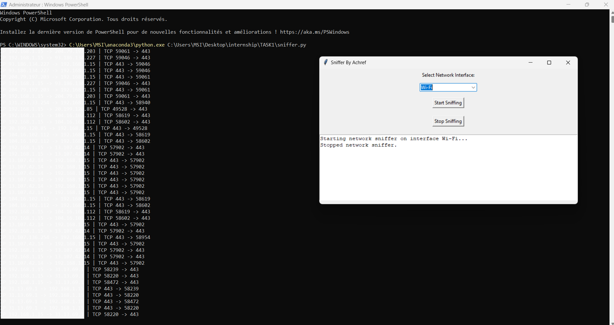

# Network Sniffer with GUI

Project Overview:

This project is a Python-based network sniffer with a graphical user interface (GUI) built using tkinter and scapy. The network sniffer captures and analyzes network traffic, focusing on TCP packets. The GUI allows users to select a network interface, start and stop packet sniffing, and view the captured packet information in real-time.

Features

Select Network Interface: Choose from available network interfaces to start sniffing.
Start and Stop Sniffing: Begin and halt packet capture with dedicated buttons.
Real-Time Output: View packet details in the terminal window as they are captured.

## Installation

Prerequisites:

Ensure you have Python installed. The recommended version is Python 3.7 or later. You will also need to install the necessary Python libraries.

Install Dependencies:

Install the required libraries using pip

-pip install scapy
For Windows, ensure you have npcap installed as scapy relies on it for packet capture. Download and install npcap from npcap.org.

## Running the Application
Clone the Repository:

git clone https://github.com/achref3050/codealpha_packet_sniffer.git

cd codealpha_packet_sniffer

Run the Sniffer:

Execute the Python script:

-python network_sniffer_gui.py

This will open the GUI where you can select a network interface, start sniffing, and stop sniffing as needed.

Usage
Select Network Interface:

From the dropdown menu in the GUI, choose the network interface you wish to use for sniffing.
Start Sniffing:

Click the "Start Sniffing" button to begin capturing packets. The captured packet information will be displayed in the terminal window.
Stop Sniffing:

Click the "Stop Sniffing" button to halt the packet capture process.
Example
Here's a snapshot of the application in action:

Contributing
Contributions are welcome! If you have suggestions or improvements, please fork the repository and create a pull request. Ensure that your code follows the existing style and includes appropriate tests.

Contact
For any questions or issues, please contact:

Email: achref.werchfeni@esprit.tn
GitHub: achref3050
